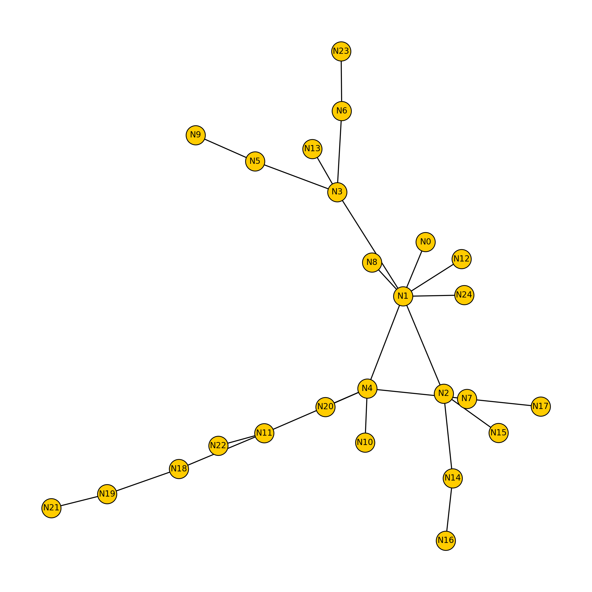

# Layer-1 vs. Lightning Network Cost‑Model Simulator

## Quick start

```bash
# clone + install
git clone *this repo*
cd *this repo*
python3 -m pip install -r requirements.txt

# run comparison + save a topology diagram
python3 sim.py        
```

---

## Repository map

| File                   | Purpose                                                                    |
| ---------------------- | -------------------------------------------------------------------------- |
| **`common.py`**        | Shared `Payment` dataclass and `NodeBase` typing stub.                     |
| **`layer1.py`**        | Bitcoin layer-1 baseline                                                   |
| **`lightning.py`**     | Lightning Network with standard Payment Channels + risk Dijkstra routing   |
| **`topo.py`**          | Barabási–Albert graph generator for LN topology                            |
| **`sim.py`**           | Driver. Builds one node set and replays identical workload on both layers. |
| **`requirements.txt`** | `simpy`, `networkx`, `matplotlib`                                          |

---

## Current simplifications (likely non-exhaustive)

### Bitcoin main‑chain

| Aspect                | Simulated       | Real world                   |
| --------------------- | --------------- | ---------------------------- |
| Block interval        | Fixed 600 s     | Mean 600 s                   |
| Confirmation target   | 6 blocks        | Wallet-specific              |
| Fee market            | Flat 25 sat/vB  | Dynamic mempool bidding      |
| Transaction size      | Constant 250 vB | Inputs/outputs dependent     |
| UTXO & change         | Ignored         | Adds vbytes & dust           |
| Mempool delay         | None            | Minutes‑hours when congested |
| Re‑org, CPFP, scripts | Not modelled    | Present                      |

### Lightning Network

| Aspect               | Simulated               | Real world                    |
| -------------------- | ----------------------- | ----------------------------- |
| Units                | satoshi                 | millisatoshi                  |
| Fee parameters       | Uniform 1 sat + 1 ppm   | Node‑specific                 |
| Path‑finding         | Dijkstra (fee + risk·Δ) | Same for LND/CLN              |
| CLTV delta           | 40 blocks everywhere    | Node-specific                 |
| Retries / MPP        | None                    | Widely used                   |
| Gossip lag & updates | Static graph            | Channels come/go, fee updates |

---

## Output excerpt

```
========== BITCOIN L1 ==========

Initial on-chain wallet balances:
  N0: 2,000,000 sat
  N1: 2,000,000 sat
  N2: 2,000,000 sat
  N3: 2,000,000 sat
  N4: 2,000,000 sat
  N5: 2,000,000 sat
  N6: 2,000,000 sat
  N7: 2,000,000 sat
  N8: 2,000,000 sat
  N9: 2,000,000 sat
  N10: 2,000,000 sat
  N11: 2,000,000 sat
  N12: 2,000,000 sat
  N13: 2,000,000 sat
  N14: 2,000,000 sat
  N15: 2,000,000 sat
  N16: 2,000,000 sat
  N17: 2,000,000 sat
  N18: 2,000,000 sat
  N19: 2,000,000 sat
  N20: 2,000,000 sat
  N21: 2,000,000 sat
  N22: 2,000,000 sat
  N23: 2,000,000 sat
  N24: 2,000,000 sat

=== On-chain payment log ===
 N20 ──   4,278 sat ─▶ N3  
 N23 ──  33,098 sat ─▶ N8  
  N7 ──  97,530 sat ─▶ N4  
  N3 ──  98,080 sat ─▶ N21 
 N17 ──  78,397 sat ─▶ N2  
 N13 ──   4,905 sat ─▶ N1  
  N2 ──  31,495 sat ─▶ N6  
 N16 ──   4,478 sat ─▶ N19 
 N17 ──  94,850 sat ─▶ N6  
 N20 ──  72,426 sat ─▶ N22 

Final on-chain wallet balances:
  N0: 2,000,000 sat
  N1: 2,004,905 sat
  N2: 2,040,652 sat
  N3: 1,899,948 sat
  N4: 2,097,530 sat
  N5: 2,000,000 sat
  N6: 2,126,345 sat
  N7: 1,896,220 sat
  N8: 2,033,098 sat
  N9: 2,000,000 sat
  N10: 2,000,000 sat
  N11: 2,000,000 sat
  N12: 2,000,000 sat
  N13: 1,988,845 sat
  N14: 2,000,000 sat
  N15: 2,000,000 sat
  N16: 1,989,272 sat
  N17: 1,814,253 sat
  N18: 2,000,000 sat
  N19: 2,004,478 sat
  N20: 1,910,796 sat
  N21: 2,098,080 sat
  N22: 2,072,426 sat
  N23: 1,960,652 sat
  N24: 2,000,000 sat

=== On-chain metrics ===
payments                     10
failed                        0
satoshi moved           519,537
total fee (sat)          62,500
avg fee per ksat         120.30
mean latency (s)       3600.000
p95 latency (s)            3600

========== LIGHTNING ==========
Initial channel balances:
  N0 ⇄  N1: 1,000,000/1,000,000 sat (cap 2,000,000)
  N0 ⇄  N24: 1,000,000/1,000,000 sat (cap 2,000,000)
  N1 ⇄  N2: 1,000,000/1,000,000 sat (cap 2,000,000)
  N1 ⇄  N3: 1,000,000/1,000,000 sat (cap 2,000,000)
  N1 ⇄  N5: 1,000,000/1,000,000 sat (cap 2,000,000)
  N1 ⇄  N6: 1,000,000/1,000,000 sat (cap 2,000,000)
  N1 ⇄  N10: 1,000,000/1,000,000 sat (cap 2,000,000)
  N1 ⇄  N14: 1,000,000/1,000,000 sat (cap 2,000,000)
  N1 ⇄  N15: 1,000,000/1,000,000 sat (cap 2,000,000)
  N1 ⇄  N16: 1,000,000/1,000,000 sat (cap 2,000,000)
  N1 ⇄  N17: 1,000,000/1,000,000 sat (cap 2,000,000)
  N1 ⇄  N20: 1,000,000/1,000,000 sat (cap 2,000,000)
  N1 ⇄  N23: 1,000,000/1,000,000 sat (cap 2,000,000)
  N2 ⇄  N4: 1,000,000/1,000,000 sat (cap 2,000,000)
  N2 ⇄  N8: 1,000,000/1,000,000 sat (cap 2,000,000)
  N5 ⇄  N9: 1,000,000/1,000,000 sat (cap 2,000,000)
  N5 ⇄  N13: 1,000,000/1,000,000 sat (cap 2,000,000)
  N5 ⇄  N22: 1,000,000/1,000,000 sat (cap 2,000,000)
  N6 ⇄  N7: 1,000,000/1,000,000 sat (cap 2,000,000)
  N6 ⇄  N12: 1,000,000/1,000,000 sat (cap 2,000,000)
  N7 ⇄  N21: 1,000,000/1,000,000 sat (cap 2,000,000)
  N9 ⇄  N11: 1,000,000/1,000,000 sat (cap 2,000,000)
  N13 ⇄  N18: 1,000,000/1,000,000 sat (cap 2,000,000)
  N16 ⇄  N19: 1,000,000/1,000,000 sat (cap 2,000,000)

=== Lightning payment log ===
 N20 ──   4,278 sat ─▶ N3  
 N23 ──  33,098 sat ─▶ N8  
  N7 ──  97,530 sat ─▶ N4  
  N3 ──  98,080 sat ─▶ N21 
 N17 ──  78,397 sat ─▶ N2  
 N13 ──   4,905 sat ─▶ N1  
  N2 ──  31,495 sat ─▶ N6  
 N16 ──   4,478 sat ─▶ N19 
 N17 ──  94,850 sat ─▶ N6  
 N20 ──  72,426 sat ─▶ N22 

Final channel balances:
  N0 ⇄  N1: 1,000,000/1,000,000 sat (cap 2,000,000)
  N0 ⇄  N24: 1,000,000/1,000,000 sat (cap 2,000,000)
  N1 ⇄  N2: 822,419/1,177,581 sat (cap 2,000,000)
  N1 ⇄  N3: 1,093,936/906,064 sat (cap 2,000,000)
  N1 ⇄  N5: 932,466/1,067,534 sat (cap 2,000,000)
  N1 ⇄  N6: 873,111/1,126,889 sat (cap 2,000,000)
  N1 ⇄  N10: 1,000,000/1,000,000 sat (cap 2,000,000)
  N1 ⇄  N14: 1,000,000/1,000,000 sat (cap 2,000,000)
  N1 ⇄  N15: 1,000,000/1,000,000 sat (cap 2,000,000)
  N1 ⇄  N16: 1,000,000/1,000,000 sat (cap 2,000,000)
  N1 ⇄  N17: 1,173,282/826,718 sat (cap 2,000,000)
  N1 ⇄  N20: 1,076,763/923,237 sat (cap 2,000,000)
  N1 ⇄  N23: 1,033,126/966,874 sat (cap 2,000,000)
  N2 ⇄  N4: 902,470/1,097,530 sat (cap 2,000,000)
  N2 ⇄  N8: 966,902/1,033,098 sat (cap 2,000,000)
  N5 ⇄  N9: 1,000,000/1,000,000 sat (cap 2,000,000)
  N5 ⇄  N13: 1,004,908/995,092 sat (cap 2,000,000)
  N5 ⇄  N22: 927,574/1,072,426 sat (cap 2,000,000)
  N6 ⇄  N7: 999,516/1,000,484 sat (cap 2,000,000)
  N6 ⇄  N12: 1,000,000/1,000,000 sat (cap 2,000,000)
  N7 ⇄  N21: 901,920/1,098,080 sat (cap 2,000,000)
  N9 ⇄  N11: 1,000,000/1,000,000 sat (cap 2,000,000)
  N13 ⇄  N18: 1,000,000/1,000,000 sat (cap 2,000,000)
  N16 ⇄  N19: 995,522/1,004,478 sat (cap 2,000,000)

=== Lightning metrics ===
payments                     10
failed                        0
satoshi moved           519,537
total fee (sat)             385
avg fee per ksat           0.74
mean latency (s)          0.500
p95 latency (s)             0.8

```

LN-Topology diagram:




